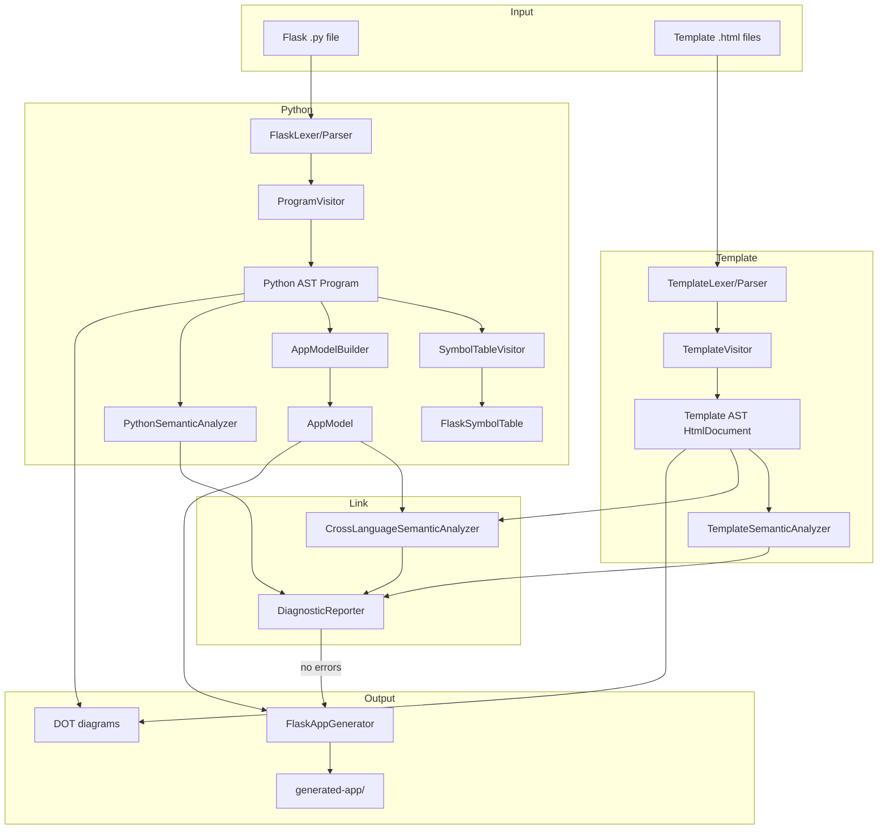

# Compiler Pipeline

```mermaid
flowchart TB
    subgraph Input
        PYFILE[Flask .py file]
        TPLFILES[Template .html files]
    end

    subgraph Python
        FL[FlaskLexer/Parser]
        PV[ProgramVisitor]
        PAST[Python AST Program]
        STV[SymbolTableVisitor]
        ST[FlaskSymbolTable]
        AMB[AppModelBuilder]
        AM[AppModel]
        PYSEM[PythonSemanticAnalyzer]
    end

    subgraph Template
        TL[TemplateLexer/Parser]
        TV[TemplateVisitor]
        TAST[Template AST HtmlDocument]
        TPLSEM[TemplateSemanticAnalyzer]
    end

    subgraph Link
        CROSS[CrossLanguageSemanticAnalyzer]
        DR[DiagnosticReporter]
    end

    subgraph Output
        GEN[FlaskAppGenerator]
        APP[generated-app/]
        DOT[DOT diagrams]
    end

    PYFILE --> FL --> PV --> PAST
    PAST --> STV --> ST
    PAST --> AMB --> AM
    PAST --> PYSEM --> DR

    TPLFILES --> TL --> TV --> TAST
    TAST --> TPLSEM --> DR

    AM --> CROSS
    TAST --> CROSS
    CROSS --> DR

    DR -->|no errors| GEN
    AM --> GEN
    GEN --> APP
    PAST --> DOT
    TAST --> DOT
```

Entry point: `Main` -> `CompilerPipeline.run(Config)`.
